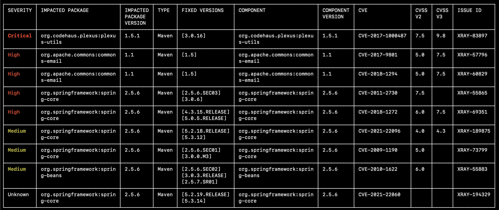
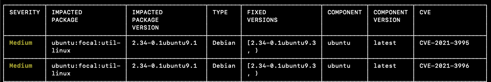
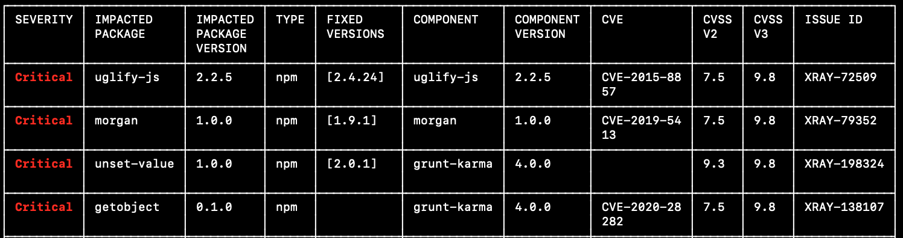

JFrog CLI : CLI for JFrog Xray
==============================

Overview
--------

This page describes how to use JFrog CLI with JFrog Xray.

Read more about JFrog CLI[here](https://jfrog.com/help/r/jfrog-cli).

### Authentication

When used with Xray, JFrog CLI offers several means of authentication: JFrog CLI does not support accessing Xray without authentication.

#### Authenticating with Username and Password

To authenticate yourself using your Xray login credentials, either configure your credentials once using the_jf c add_command or provide the following option to each command.

|                |                                                         |
|----------------|---------------------------------------------------------|
| Command option | Description                                             |
| --url          | JFrog Xray API endpoint URL. It usually ends with /xray |
| --user         | JFrog username                                          |
| --password     | JFrog password                                          |

#### Authenticating with an Access Token

To authenticate yourself using an Xray Access Token, either configure your Access Token once using the _jf c add_command or provide the following option to each command.

|                |                                                         |
|----------------|---------------------------------------------------------|
| Command option | Description                                             |
| --url          | JFrog Xray API endpoint URL. It usually ends with /xray |
| --access-token | JFrog access token                                      |


* * *

General Commands
----------------

### Running cUrl

Execute a cUrl command, using the configured Xray details. The command expects the cUrl client to be included in the PATH.

|                          |                                                                                                                                                                                                                                                                                      |
|--------------------------|--------------------------------------------------------------------------------------------------------------------------------------------------------------------------------------------------------------------------------------------------------------------------------------|
| Command name             | xr curl                                                                                                                                                                                                                                                                              |
| Abbreviation             | xr cl                                                                                                                                                                                                                                                                                |
| Command options          |                                                                                                                                                                                                                                                                                      |
| --server-id              | \[Optional\]<br><br>Server ID configured using the _jf c add_ command. If not specified, the default configured server is used.                                                                                                                                                      |
| Command arguments        |                                                                                                                                                                                                                                                                                      |
| cUrl arguments and flags | The same list of arguments and flags passed to cUrl, except for the following changes:<br><br>1.  The full Xray URL should not be passed. Instead, the REST endpoint URI should be sent.<br>2.  The login credentials should not be passed. Instead, the --server-id should be used. |

#### **Examples**

**Example 1**

Execute the cUrl client, to send a GET request to the /api/system/version endpoint to the default configured Xray server.

	jf xr curl -XGET /api/v1/system/version

**Example 2**

Execute the cUrl client, to send a GET request to the /api/v1/system/version endpoint to the configured my-xr-server server ID.

	jf rt curl -XGET /api/v1/system/version --server-id my-xr-server

  

### Downloading updates for Xray's database

The offline-update command downloads updates to the for Xray's vulnerabilities database. The Xray UI allows building the command structure for you.

|                   |                                                                                                            |
|-------------------|------------------------------------------------------------------------------------------------------------|
| Command name      | xr offline-update                                                                                          |
| Abbreviation      | xr ou                                                                                                      |
| Command options   |                                                                                                            |
| --license-id      | \[Mandatory\]<br><br>Xray license ID.                                                                      |
| --from            | \[Optional\]<br><br>From update date in YYYY-MM-DD format.                                                 |
| --to              | \[Optional\]<br><br>To update date in YYYY-MM-DD format.                                                   |
| --version         | \[Optional\]<br><br>Xray API version.                                                                      |
| --target          | \[Default: ./\]<br><br>Path for downloaded update files.                                                   |
| --dbsyncv3        | \[Default: false\]<br><br>Set to true to use Xray DBSync V3.                                               |
| --periodic        | \[Default: false\]<br><br>Set to true to get the Xray DBSync V3 Periodic Package (Use with dbsyncv3 flag). |
| Command arguments | The command accepts no arguments.                                                                          |

* * *

On-Demand Binary Scan
---------------------

The [on-demand binary scanning](https://jfrog-staging-external.fluidtopics.net/r/help/DevSecOps-Xray/Xray-On-Demand-Binary-Scan)enables you to point to a binary in your local file system and receive a report that contains a list of vulnerabilities, licenses, and policy violations for that binary prior to uploading the binary or build to Artifactory.

### Scanning Files on the Local File System

This **jf scan**_ command scans files on the local file-system with Xray.

---
**Note**
> This command requires:

* Version 3.29.0 or above of Xray
* Version 2.1.0 or above of JFrog CLI
---

|                       |                                                                                                                                                                                                                                                                                                                                                                 |
|-----------------------|-----------------------------------------------------------------------------------------------------------------------------------------------------------------------------------------------------------------------------------------------------------------------------------------------------------------------------------------------------------------|
| **Command name**      | scan                                                                                                                                                                                                                                                                                                                                                            |
| **Abbreviation**      | s                                                                                                                                                                                                                                                                                                                                                               |
| **Command options**   |                                                                                                                                                                                                                                                                                                                                                                 |
| --server-id           | \[Optional\]<br><br>Server ID configured using the _jf c add_ command. If not specified, the default configured server is used.                                                                                                                                                                                                                                 |
| --spec                | \[Optional\]<br><br>Path to a file specifying the files to scan. If the pattern argument is provided to the command, this option should not be provided.                                                                                                                                                                                                        |
| --project             | \[Optional\]<br><br>JFrog project key, to enable Xray to determine security violations accordingly. The command accepts this option only if the --repo-path and --watches options are not provided. If none of the three options are provided, the command will show all known vulnerabilities.                                                                 |
| --repo-path           | \[Optional\]<br><br>Artifactory repository path in the form of &lt;repository&gt;/&lt;path in the repository&gt;, to enable Xray to determine violations accordingly. The command accepts this option only if the --project and --watches options are not provided. If none of the three options are provided, the command will show all known vulnerabilities. |
| --watches             | \[Optional\]<br><br>A comma separated list of Xray watches, to enable Xray to determine violations accordingly. The command accepts this option only if the --project and --repo-path options are not provided. If none of the three options are provided, the command will show all known vulnerabilities.                                                     |
| --licenses            | \[Default: false\]<br><br>Set if you also require the list of licenses to be displayed.                                                                                                                                                                                                                                                                         |
| --format=json         | \[Optional\]<br><br>Produces a JSON file containing the scan results.                                                                                                                                                                                                                                                                                           |
| **Command arguments** |                                                                                                                                                                                                                                                                                                                                                                 |
| **Pattern**           | Specifies the local file system path to artifacts to be scanned. You can specify multiple files by using wildcards.                                                                                                                                                                                                                                             |

**Output Example**



**Examples**

**Example 1**

Scans all the files located at the path/ti/files/ file-system directory using the watch1 watch defined in Xray.

	jf s "path/to/files/" --watches "watch1"

  

**Example 2**  
Scans all the files located at the path/ti/files/ file-system directory using the _watch1_ and _watch2_ Watches defined in Xray.  

	jf s "path/to/files/" --watches "watch1,watch2"

  

**Example 3**

Scans all the zip files located at the path/ti/files/ file-system directory using the _watch1_ and _watch2_ Watches defined in Xray.

	jf s "path/to/files/*.zip" --watches "watch1,watch2"

  

**Example 4**

Scans all the tgz files located at the path/ti/files/ file-system directory using the policies defined for project-1.  

	jf s "path/to/files/*.tgz" --project "project-1"

  

**Example 5**  
Scans all the tgz files located in the current directory using the policies defined for the libs-local/release-artifacts/ path in Artifactory.  

	jf s "*.tgz" --repo-path "libs-local/release-artifacts/"

  

**Example 6**  
Scans all the tgz files located at the current directory. Show all known vulnerabilities, regardless of the policies defined in Xray.

	jf s "*.tgz"

* * *

### **Scanning Docker Containers on the Local File System**

This j_**f docker scan**_ command scans docker containers located on the local file-system using the _**docker client**_ and _**JFrog Xray**_. The containers don't need to be deployed to Artifactory or any other container registry before it can be scanned.

---
**Note**
> This command requires:

* Version 3.40.0 or above of Xray
* Version 2.11.0 or above of JFrog CLI
---

|                       |                                                                                                                                                                                                                                                                                                                                                                 |
|-----------------------|-----------------------------------------------------------------------------------------------------------------------------------------------------------------------------------------------------------------------------------------------------------------------------------------------------------------------------------------------------------------|
| **Command name**      | docker scan                                                                                                                                                                                                                                                                                                                                                     |
| **Abbreviation**      |                                                                                                                                                                                                                                                                                                                                                                 |
| **Command options**   |                                                                                                                                                                                                                                                                                                                                                                 |
| --server-id           | \[Optional\]<br><br>Server ID configured using the _jf c add_ command. If not specified, the default configured server is used.                                                                                                                                                                                                                                 |
| --project             | \[Optional\]<br><br>JFrog project key, to enable Xray to determine security violations accordingly. The command accepts this option only if the --repo-path and --watches options are not provided. If none of the three options are provided, the command will show all known vulnerabilities.                                                                 |
| --repo-path           | \[Optional\]<br><br>Artifactory repository path in the form of &lt;repository&gt;/&lt;path in the repository&gt;, to enable Xray to determine violations accordingly. The command accepts this option only if the --project and --watches options are not provided. If none of the three options are provided, the command will show all known vulnerabilities. |
| --watches             | \[Optional\]<br><br>A comma separated list of Xray watches, to enable Xray to determine violations accordingly. The command accepts this option only if the --repo-path and --repo-path options are not provided. If none of the three options are provided, the command will show all known vulnerabilities.                                                   |
| --licenses            | \[Default: false\]<br><br>Set if you also require the list of licenses to be displayed.                                                                                                                                                                                                                                                                         |
| --format=json         | \[Optional\]<br><br>Produces a JSON file containing the scan results.                                                                                                                                                                                                                                                                                           |
| **Command arguments** |                                                                                                                                                                                                                                                                                                                                                                 |
| **Pattern**           | Specifies the local file system path to artifacts to be scanned. You can specify multiple files by using wildcards.                                                                                                                                                                                                                                             |

  

**Output Example**



**Examples**

**Example 1**

Scan the local _reg1/repo1/img1:1.0.0_ container and show all known vulnerabilities, regardless of the policies defined in Xray.

```
$ docker images
REPOSITORY           TAG       IMAGE ID       CREATED         SIZE
reg1/repo1/img1   1.0.0     6446ea57df7b   19 months ago   5.57MB
$ 
$ jf docker scan reg1/repo1/img1:1.0.0
```
  

**Example 2**

Scan the local _reg1/repo1/img1:1.0.0_ container and show all violations according to the policy associated with _my-project_ JFrog project.

```
$ docker images
REPOSITORY           TAG       IMAGE ID       CREATED         SIZE
reg1/repo1/img1   1.0.0     6446ea57df7b   19 months ago   5.57MB
$ 
$ jf docker scan reg1/repo1/img1:1.0.0 --project my-project
```
  

**Example 3**

Scan the local _reg1/repo1/img1:1.0.0_ container and show all violations according to the policy associated with _my-watch_ Xray Watch.

```
$ docker images
REPOSITORY           TAG       IMAGE ID       CREATED         SIZE
reg1/repo1/img1   1.0.0     6446ea57df7b   19 months ago   5.57MB
$ 
$ jf docker scan reg1/repo1/img1:1.0.0 --watches my-watch
```
  

**Example 4**

Scan the local _reg1/repo1/img1:1.0.0_ container and show all violations according to the policy associated with _releases-local/app1/_ path in Artifactory.

```
$ docker images
REPOSITORY           TAG       IMAGE ID       CREATED         SIZE
reg1/repo1/img1   1.0.0     6446ea57df7b   19 months ago   5.57MB
$ 
$ jf docker scan reg1/repo1/img1:1.0.0 --repo-path releases-local/app1/
```

### Scanning Image Tarballs on the Local File System

The ‘`scan`’ command can be used to scan tarballs of Docker and OCI images on the local file system.

It requires saving the image on the file system as an uncompressed tarball using a compliant tool, and then scan it with the ‘`jf s`’ command. The image must be saved to the file-system uncompressed, in a `<name>.tar` file name.

---
**Note**
> This command requires:

* Version 3.61.5 or above of Xray.
* Version 2.14.0 or above of JFrog CLI.
---
  

#### Docker Client

#### Use Docker client ‘`docker save`’ command to save the image to the file system for scanning.

**Example**:

  
```
$ docker images
REPOSITORY TAG IMAGE ID CREATED SIZE
my-image 1.0.0 aaaaabbcccddd 2 months ago 1.12MB

$ docker save --output my-image-docker.tar my-image:1.0.0
$ jf s my-image-docker.tar
```
  

#### Skopeo

Use Skopeo CLI to save an image to the file system. Output image can be either OCI or Docker format.

**Example**:

  
```
$ docker images
REPOSITORY TAG IMAGE ID CREATED SIZE
my-image 1.0.0 aaaaabbcccddd 2 months ago 1.12MB

// Scan an image in Docker format
$ skopeo copy docker-daemon:my-image:1.0.0 docker-archive:my-image-docker.tar
$ jf s my-image-docker.tar

// Scan an image in OCI format
$ skopeo copy docker-daemon:my-image:1.0.0 oci-archive:my-image-oci.tar
$ jf s my-image-oci.tar
```
  

#### Podman

Use Podman CLI to save an image to the file system.Output image can be either OCI or Docker format.

**Example**:

  
```
$ podman images
REPOSITORY TAG IMAGE ID CREATED SIZE
my-image 1.0.0 aaaaabbcccddd 2 months ago 1.12MB

// Scan an image in Docker format
$ podman save --format=docker-archive -o my-image-docker.tar my-image:1.0.0
$ jf s my-image-docker.tar

// Scan an image in OCI format
$ podman save --format=oci -o my-image-oci.tar my-image:1.0.0
$ jf s my-image-oci.tar
```
  

#### Kaniko

Use Kaniko ‘`--tarPath’` flag to save built images to the file system, later scan them with JFrog CLI. The example below is running Kaniko in Docker.

**Example**:

  
```
$ cat Dockerfile

FROM alpine:3.16

$ docker run -it --rm -v $(pwd):/workspace gcr.io/kaniko-project/executor:v1.8.1-debug -f Dockerfile --no-push --tarPath my-image.tar -d my-image:1.0 -c . --cleanup

$ jf s my-image.tar
```
  

Scanning Project Dependencies
-----------------------------

The _**jf audit**_ command allows scanning your source code dependencies to find security vulnerabilities and licenses violations, with the ability to scan against your Xray policies. The command builds a deep dependencies graph for your project, scans it with Xray, and displays the results. It uses the package manager used by the project to build the dependencies graph. Currently, the following package managers are supported.

* Maven (mvn) - Version 3.1.0 or above of Maven is supported.
* Gradle (gradle)
* Npm (npm)
* Yarn 2 (yarn)
* Pip (pip)
* Pipenv (pipenv)
* Poetry (poetry)
* Go Modules (go)
* NuGet (nuget)
* .NET Core CLI (dotnet)

The command will detect the package manager used by the project automatically. It requires version 3.29.0 or above of Xray and also version 2.13.0 or above of JFrog CLI.

---
**Note**
> * Before running the command, ensure that the project dependencies are already cached on the local file-system, by running the appropriate command of the relevant package manager. For example - **npm install** or **nuget restore**.
> * The _**jf audit**_ command does not extract the internal content of the scanned dependencies. This means that if a package includes other vulnerable components, they may not be shown as part of the results. This is contrary to the _**jf scan**_ command, which drills down into the package content.
---

|                       |                                                                                                                                                                                                                                                                                                                                                                |
|-----------------------|----------------------------------------------------------------------------------------------------------------------------------------------------------------------------------------------------------------------------------------------------------------------------------------------------------------------------------------------------------------|
| **Command name**      | audit                                                                                                                                                                                                                                                                                                                                                          |
| **Abbreviation**      | aud                                                                                                                                                                                                                                                                                                                                                            |
| **Command options**   |                                                                                                                                                                                                                                                                                                                                                                |
| --server-id           | \[Optional\]<br><br>Server ID configured using the _jf c add_ command. If not specified, the default configured server is used.                                                                                                                                                                                                                                |
| --project             | \[Optional\]<br><br>JFrog project key, to enable Xray to determine security violations accordingly. The command accepts this option only if the --repo-path and --watches options are not provided. If none of the three options are provided, the command will show all known vulnerabilities                                                                 |
| --repo-path           | \[Optional\]<br><br>Artifactory repository path in the form of &lt;repository&gt;/&lt;path in the repository&gt;, to enable Xray to determine violations accordingly. The command accepts this option only if the --project and --watches options are not provided. If none of the three options are provided, the command will show all known vulnerabilities |
| --watches             | \[Optional\]<br><br>A comma separated list of Xray watches, to enable Xray to determine violations accordingly. The command accepts this option only if the --repo-path and --repo-path options are not provided. If none of the three options are provided, the command will show all known vulnerabilities                                                   |
| --licenses            | \[Default: false\]<br><br>Set if you'd also like the list of licenses to be displayed.                                                                                                                                                                                                                                                                         |
| --format              | \[Default: table\]<br><br>Defines the output format of the command. Acceptable values are: table and json.                                                                                                                                                                                                                                                     |
| --fail                | \[Default: true\]<br><br>Set to false if you do not wish the command to return exit code 3, even if the 'Fail Build' rule is matched by Xray.                                                                                                                                                                                                                  |
| --use-wrapper         | \[Default: false\] \[Gradle\]<br><br>Set to true if you'd like to use the Gradle wrapper.                                                                                                                                                                                                                                                                      |
| --dep-type            | \[Default: all\] \[npm\]<br><br>Defines npm dependencies type. Possible values are: all, devOnly and prodOnly                                                                                                                                                                                                                                                  |
| --exclude-test-deps   | \[Default: false\] \[Gradle\]<br><br>Set to true if you'd like to exclude Gradle test dependencies from Xray scanning.                                                                                                                                                                                                                                         |
| --requirements-file   | \[Optional\] \[Pip\]<br><br>Defines pip requirements file name. For example: 'requirements.txt'                                                                                                                                                                                                                                                                |
| --working-dirs        | \[Optional\]<br><br>A comma separated list of relative working directories, to determine the audit targets locations.                                                                                                                                                                                                                                          |
| --fixable-only        | \[Optional\]<br><br>Set to true if you wish to display issues which have a fix version only.                                                                                                                                                                                                                                                                   |
| --min-severity        | \[Optional\]<br><br>Set the minimum severity of issues to display. The following values are accepted: Low, Medium, High or Critical                                                                                                                                                                                                                            |
| --go                  | \[Default: false\]<br><br>Set to true to request audit for a Go project.                                                                                                                                                                                                                                                                                       |
| --gradle              | \[Default: false\]<br><br>Set to true to request audit for a Gradle project.                                                                                                                                                                                                                                                                                   |
| --mvn                 | \[Default: false\]<br><br>Set to true to request audit for a Maven project.                                                                                                                                                                                                                                                                                    |
| --npm                 | \[Default: false\]<br><br>Set to true to request audit for a npm project.                                                                                                                                                                                                                                                                                      |
| --nuget               | \[Default: false\]<br><br>Set to true to request audit for a .Net project.                                                                                                                                                                                                                                                                                     |
| --pip                 | \[Default: false\]<br><br>Set to true to request audit for a Pip project.                                                                                                                                                                                                                                                                                      |
| --pipenv              | \[Default: false\]<br><br>Set to true to request audit for a Pipenv project.                                                                                                                                                                                                                                                                                   |
| --yarn                | \[Default: false\]<br><br>Set to true to request audit for a Yarn 2+ project.                                                                                                                                                                                                                                                                                  |
| **Command arguments** | The command accepts no arguments                                                                                                                                                                                                                                                                                                                               |

#### **Output Example**



#### Examples

**Example 1**

Audit the project at the current directory. Show all known vulnerabilities, regardless of the policies defined in Xray.  

	jf audit

**Example 2**

Audit the project at the current directory. Show all known vulnerabilities, regardless of the policies defined in Xray. Show only maven and npm vulnerabilities.

	jf audit --mvn --npm

**Example 3**

Audit the project at the current directory using a watch named _watch1_ watch defined in Xray.

	jf audit --watches "watch1"

**Example 4**

Audit the project at the current directory using _watch1_ and _watch2_defined in Xray.

	jf audit --watches "watch1,watch2"

**Example 5**

Audit the project at the current directory using the policies defined for project-1.  

	jf audit --project "project-1"

**Example 6**

Audit the project at the current directory using the policies defined for the _libs-local/release-artifacts/_ path in Artifactory.  

	jf audit --repo-path "libs-local/release-artifacts/"

Scanning Published Builds
-------------------------

JFrog CLI is integrated with JFrog Xray and JFrog Artifactory, allowing you to have your build artifacts and dependencies scanned for vulnerabilities and license violations. This command allows scanning a build, which had already been published to Artifactory using the [build-publish command](https://jfrog.com/help/r/jfrog-cli/publishing-build-info).

|                   |                                                                                                                                                                                                                                         |
|-------------------|-----------------------------------------------------------------------------------------------------------------------------------------------------------------------------------------------------------------------------------------|
| Command name      | build-scan                                                                                                                                                                                                                              |
| Abbreviation      | bs                                                                                                                                                                                                                                      |
| Command options   |                                                                                                                                                                                                                                         |
| --server-id       | \[Optional\]<br><br>Server ID configured by the _jf c add_ command. If not specified, the default configured server is used.                                                                                                            |
| --vuln            | \[Optional\]<br><br>Set if you'd like to receive all vulnerabilities, regardless of the policy configured in Xray.                                                                                                                      |
| --fail            | \[Default: true\]<br><br>When set, the command returns exit code 3 if a 'Fail Build' rule is matched by Xray.  <br>Set to false if you do not wish the command to return exit code 3 in such case, and an exit code 0 will be returned. |
| --format          | \[Default: table\]<br><br>Defines the output format of the command. The accepted values are: **_table_** and _**json**_.                                                                                                                |
| --project         | \[Optional\]<br><br>JFrog project key                                                                                                                                                                                                   |
| --rescan          | \[Default: false\]<br><br>Set to true when scanning an already successfully scanned build, for example after adding an ignore rule.                                                                                                     |
| Command arguments | The command accepts two arguments.                                                                                                                                                                                                      |
| Build name        | Build name to be scanned.                                                                                                                                                                                                               |
| Build number      | Build number to be scanned.                                                                                                                                                                                                             |

##### Example

	jf bs my-build-name 18

 
