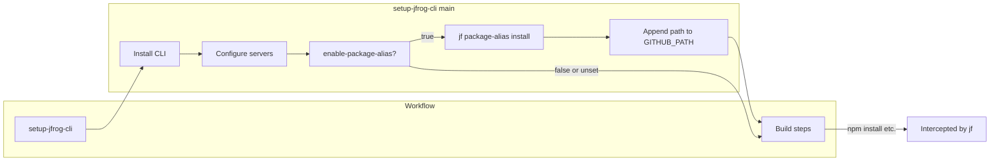
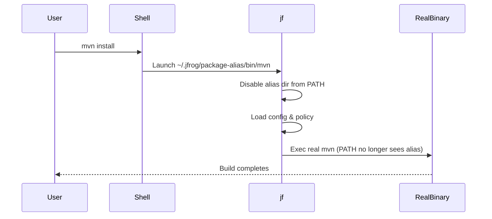

# **Technical Design: Per-Process JFrog CLI Package Aliasing**

**Version:** 1.1  
**Owner:** JFrog CLI Team  
**Last Updated:** 2025-11-12  

---

## **1. Overview**

The goal of this design is to make JFrog CLI automatically intercept common package manager commands such as `mvn`, `npm`, `go`, `gradle`, etc. without requiring users to prepend commands with `jf` (e.g., `jf mvn install`).  
Users should be able to continue running:

```bash
mvn clean install
npm install
go build
```

…and JFrog CLI should transparently process these commands using the user’s Artifactory configuration.

We call this feature **Package Aliasing**.

---

## **2. Motivation**

Today, users must explicitly prefix package manager commands with `jf`:

```bash
jf mvn install
jf npm install
```

This adds friction for large enterprises or CI systems that have hundreds of pipelines or legacy scripts.  
Our goal is **zero-change enablement** — install once, and all existing build commands automatically benefit from JFrog CLI.

---

## **3. Requirements**

| Category | Requirement |
|-----------|--------------|
| **Functionality** | Intercept common package manager binaries (`mvn`, `npm`, `yarn`, `pnpm`, `go`, `gradle`, etc.) |
| | Execute through JFrog CLI integration flows |
| | Allow fallback to real binaries if required |
| **Safety** | Avoid infinite recursion (loops) |
| | No modification to system binaries (no sudo) |
| | Work for user scope (non-root) |
| **Portability** | Linux, macOS, Windows |
| **Control** | Allow per-process disable, per-tool policy |
| **Simplicity** | Single fixed directory for aliases, predictable behavior |
| **No invasive change** | No modification to every `exec` or binary path in existing code |

---

## **4. Problem Evolution**

This section explains each major problem we encountered and how the solution evolved.

---

### **4.1 How to intercept native package manager commands**

**Problem:**  
We need a way for `mvn`, `npm`, etc. to invoke `jf` automatically.

**Explored Solutions:**

| Approach | Description | Pros | Cons |
|-----------|--------------|------|------|
| 1. Modify system binaries (/usr/bin) | Replace `/usr/bin/mvn` with wrapper pointing to `jf` | Transparent | Needs sudo, risky, hard to undo |
| 2. PATH-first “symlink farm” | Create `mvn → jf`, `npm → jf`, etc. in a user-controlled directory that appears first in `$PATH` | Safe, user-space only, reversible | Must manage PATH carefully |
| 3. LD_PRELOAD interception | Use dynamic linker trick to intercept exec calls | Too complex, platform-specific | Unmaintainable |
| 4. Shell aliasing | Define `alias mvn='jf mvn'` etc. | Shell-only, not CI-safe | |

**Decision:**  
✅ Use **PATH-first symlink farm** approach (Approach #2).  
We create symbolic links to `jf` in `~/.jfrog/package-alias/bin` and prepend this directory to `$PATH`.

---

### **4.2 Where to store aliases**

**Problem:**  
Users shouldn’t decide arbitrary paths for aliases — that leads to chaos in PATH management.

**Explored Solutions:**

| Option | Description | Drawback |
|---------|--------------|-----------|
| Allow users to specify install directory | `jf package-alias install --dir=/custom/dir` | Too many inconsistent setups |
| Fixed directory under ~/.jfrog | `~/.jfrog/package-alias/bin` | Predictable, easy to clean up |

**Decision:**  
✅ Fixed directory: `~/.jfrog/package-alias/bin` for Linux/macOS, `%USERPROFILE%\.jfrog\package-alias\bin` for Windows.

---

### **4.3 Avoiding loops / recursion (final decision)**

**Problem:**  
When `jf` is invoked via an alias (e.g., `~/.jfrog/package-alias/bin/mvn → jf`) and later tries to execute `mvn` again, a naive `PATH` lookup may return the alias *again*, creating a loop.

**Final Decision:**  
Use a **per-process PATH filter**. As soon as `jf` detects it was invoked via an alias (by checking `argv[0]`), it removes the alias directory from **its own** `PATH`. From that moment on, every `exec` or `LookPath` performed by this process (and any child processes it spawns) will only see the **real** tools, not the aliases. No global changes, no filesystem renames, no sudo.

**Why this solves recursion:**  
- The alias directory is *invisible* to this process after the filter.
- Any subsequent `exec.LookPath("mvn")` resolves to the real `mvn`.
- Children inherit the filtered `PATH`, so they can’t bounce back into aliases either.

**Code (core):**
```go
func disableAliasesForThisProcess() {
    aliasDir := filepath.Join(userHome(), ".jfrog", "package-alias", "bin")
    old := os.Getenv("PATH")
    filtered := filterOutDirFromPATH(old, aliasDir)
    _ = os.Setenv("PATH", filtered) // process-local, inherited by children
}
```

**Alternatives considered (rejected):**
- Absolute paths recorded at install time → safe but adds state to maintain.
- Env-guard like `JF_BYPASS=1` → requires propagation to all subprocesses.
- Renaming/temporarily hiding the alias directory → racy across shells/processes.

---

### **4.4 Why we do NOT use guard variables (e.g., `JF_BYPASS`)**

Using a guard env var would require **plumbing that variable through every exec site** and relying on every sub-tool to pass it along. This is brittle and easy to miss in a large legacy codebase. With the **per-process PATH filter**, no extra env propagation is needed; the operating system already inherits the filtered `PATH` for all children, which reliably prevents recursion.

> In short: **No guard variables are used.** The single mechanism is **per-process PATH filtering** applied at `jf` entry when invoked via an alias.

---

## **5. Final Architecture**

### **5.1 Components**

```
~/.jfrog/package-alias/
├── bin/                     # symlinks or copies to jf
│   ├── mvn -> /usr/local/bin/jf
│   ├── npm -> /usr/local/bin/jf
│   └── go  -> /usr/local/bin/jf
├── manifest.json            # real binary paths (optional)
├── config.yaml              # package modes, enabled flag
└── state.json               # internal enable/disable
```

### **5.2 High-level flow**

```mermaid
flowchart TD
    A[User runs mvn install] --> B[$PATH resolves ~/.jfrog/package-alias/bin/mvn]
    B --> C[jf binary invoked (argv[0] = "mvn")]
    C --> D[Disable alias dir from PATH for this process]
    D --> E[Lookup policy for mvn]
    E -->|mode = jf| F[Run jf mvn integration flow]
    E -->|mode = env| G[Inject env vars + exec real mvn]
    E -->|mode = pass| H[Exec real mvn directly]
    F --> I[Child processes inherit filtered PATH]
    G --> I
    H --> I[All children see real mvn; no loop]
```

---

## **6. Detailed Flow and Problem Solving**

### **6.1 Installation**

```bash
jf package-alias install
```

**Steps**
1. Create `~/.jfrog/package-alias/bin` if not exists.
2. Find `jf` binary path.
3. Create symlinks (`ln -sf`) or copies (on Windows) for each supported package manager.
4. Write `manifest.json` with discovered real binary paths.
5. Show message to add the directory to PATH:
   ```bash
   export PATH="$HOME/.jfrog/package-alias/bin:$PATH"
   ```
6. Ask user to `hash -r` (clear shell cache).

---

### **6.2 Execution (Intercept Flow)**

When a symlinked tool is run, e.g. `mvn`:

1. The OS resolves `mvn` to `~/.jfrog/package-alias/bin/mvn`.
2. The binary launched is actually `jf`.
3. Inside `jf`:
   ```go
   tool := filepath.Base(os.Args[0]) // mvn, npm, etc.
   if isAlias(tool) {
       disableAliasesForThisProcess() // remove alias dir from PATH
       mode := loadPolicy(tool)
       runByMode(tool, mode, os.Args[1:])
   }
   ```
4. `disableAliasesForThisProcess` updates the process’s environment:
   ```go
   func disableAliasesForThisProcess() {
       aliasDir := filepath.Join(userHome(), ".jfrog", "package-alias", "bin")
       old := os.Getenv("PATH")
       new := filterOutDirFromPATH(old, aliasDir)
       os.Setenv("PATH", new)
   }
   ```
5. From this point onward, any `exec.LookPath("mvn")` resolves to the *real* binary.

---

### **6.3 Fallback Handling**

If the integration flow fails (e.g., Artifactory config missing):

1. Try to exec the real binary using `syscall.Exec(realPath, args, env)`.
2. Because the alias dir was removed from PATH, `exec.LookPath(tool)` already points to the real one.
3. The process is replaced with the real binary — no recursion.

---

### **6.4 Disable/Enable**

```bash
jf package-alias disable
jf package-alias enable
```

Sets a flag in `~/.jfrog/package-alias/state.json`:
```json
{ "enabled": false }
```

During argv[0] dispatch, if disabled, `jf` immediately executes the real tool via filtered PATH.

---

### **6.5 Windows Behavior**

- Instead of symlinks, create **copies** of `jf.exe` named `mvn.exe`, `npm.exe`, etc.  
- PATH modification is identical (`%USERPROFILE%\.jfrog\package-alias\bin`).
- When invoked, `jf.exe` runs the same per-process `PATH` filtering logic.
- To run the real binary, use `where mvn` after filtering PATH.

---

## **7. Safety and Rollback**

| Action | Result |
|---------|--------|
| `jf package-alias uninstall` | Removes all symlinks and manifest |
| Remove PATH entry manually | Aliases no longer used |
| Delete `~/.jfrog/package-alias/bin` | Full disable, no residual effect |
| Run `hash -r` or new shell | Flushes cached command paths |

---

## **8. Key Advantages of Final Design**

| Problem | Solved By |
|----------|------------|
| Need to intercept `mvn`, `npm`, etc. | PATH-first symlinks |
| No sudo access | User directory only |
| Avoid infinite loops | Remove alias dir from PATH per process |
| No guard propagation | PATH change inherited automatically |
| Fallback to real binaries | `exec.LookPath` + filtered PATH |
| Disable/enable easily | config flag or uninstall |
| Cross-platform support | symlinks (POSIX) / copies (Windows) |

---

## **9. Example Run**

```bash
$ jf package-alias install
Created 8 aliases in ~/.jfrog/package-alias/bin
Add this to your shell rc:
  export PATH="$HOME/.jfrog/package-alias/bin:$PATH"

$ mvn clean install
# -> actually runs jf, which removes alias dir from PATH, executes jf mvn logic,
# -> calls real mvn when needed without recursion.
```

---

### **9.1 GitHub Actions integration: setup-jfrog-cli and automatic build-info publish**

In GitHub Actions, using the official **setup-jfrog-cli** action together with Package Aliasing gives **zero-change enablement** and **automatic build-info publication**. The action installs and configures JFrog CLI, and at job end it automatically publishes collected build-info to Artifactory. You do not need to add build name/number to individual commands or run `jf rt build-publish` manually unless you want a custom publish step.

**Auto-publish behavior:**

- Build-related operations (e.g. `npm install`, `mvn install`, `go build`) are recorded during the job when run via the aliases.
- The **setup-jfrog-cli** action sets `JFROG_CLI_BUILD_NAME` and `JFROG_CLI_BUILD_NUMBER` by default from workflow metadata; you may override them via `env` if needed.
- Collected build-info is **published automatically** when the job completes. If you run `jf rt build-publish` yourself in the workflow, that run’s behavior takes precedence and the action will not publish again for that job.
- To disable automatic publish, set the action input: `disable-auto-build-publish: true`.

**Native Package Alias integration (setup-jfrog-cli):**

When **setup-jfrog-cli** is used with the input `enable-package-alias: true`, the action will automatically:

1. Run `jf package-alias install` after installing and configuring JFrog CLI.
2. Append the alias directory (`~/.jfrog/package-alias/bin` on Linux/macOS, `%USERPROFILE%\.jfrog\package-alias\bin` on Windows) to the file pointed to by `GITHUB_PATH`.

GitHub Actions **prepends** paths added via `GITHUB_PATH` to `PATH` for all subsequent steps. So the alias directory is at the **front** of `PATH`; commands like `mvn`, `npm`, and `go` resolve to the Ghost Frog aliases first, and the real system binaries are not used until the alias invokes them internally. No separate workflow step is required.

**Flow: how the optional input drives setup-jfrog-cli behavior**



**Recommended pattern for Ghost Frog pipelines:**

- Use `jfrog/setup-jfrog-cli@v4` with your chosen authentication (e.g. `JF_URL`, `JF_ACCESS_TOKEN`).
- Set `enable-package-alias: true` on the action to enable Package Aliasing in one step; or, if you prefer or use an older action version, run `jf package-alias install` and append the alias directory to `GITHUB_PATH` in a separate step.
- Keep existing build steps unchanged (e.g. `npm install`, `mvn package`). Prefer letting the action auto-publish build-info unless you need a custom publish stage.

**Minimal workflow (one step — using native integration):**

```yaml
jobs:
  build:
    runs-on: ubuntu-latest
    steps:
      - uses: actions/checkout@v4

      - name: Setup JFrog CLI and Package Aliasing
        uses: jfrog/setup-jfrog-cli@v4
        with:
          enable-package-alias: true
        env:
          JF_URL: ${{ secrets.JFROG_URL }}
          JF_ACCESS_TOKEN: ${{ secrets.JFROG_ACCESS_TOKEN }}

      - name: Build
        run: |
          npm install
          npm run build
          # Build-info collected above is published automatically at job end
```

**Alternative: manual Package Alias step** (e.g. when not using `enable-package-alias` or on older action versions):

```yaml
      - name: Setup JFrog CLI
        uses: jfrog/setup-jfrog-cli@v4
        env:
          JF_URL: ${{ secrets.JFROG_URL }}
          JF_ACCESS_TOKEN: ${{ secrets.JFROG_ACCESS_TOKEN }}

      - name: Enable Ghost Frog package aliases
        run: |
          jf package-alias install
          echo "$HOME/.jfrog/package-alias/bin" >> $GITHUB_PATH

      - name: Build
        run: |
          npm install
          npm run build
```

---

## **10. Future Enhancements**

The long-term vision for **JFrog Package Alias** goes beyond just command interception — it aims to make **automatic Artifactory enablement** possible for any environment, regardless of prior repository configuration.

### **10.1 Auto-Configuration of Package Managers**

When JFrog CLI is installed and package aliasing is enabled, the CLI can automatically:
- Detect the **project type** (Maven, NPM, Go, Gradle, Python, etc.).
- Read the existing configuration (e.g., `.npmrc`, `settings.xml`, `go env GOPROXY`, etc.).
- Update or patch configuration files to route all dependency downloads and publishes to **JFrog Artifactory**.

**Example flow:**
```bash
$ jf package-alias configure
🔧 Detected package managers: npm, maven, go
✔ npmrc updated to use Artifactory registry
✔ Maven settings.xml updated with Artifactory server
✔ GOPROXY updated to Artifactory virtual repository
```

---

### **10.2 Guided Migration from Other Repository Managers**

Many organizations use other repository managers such as:
- Sonatype Nexus
- GitHub Packages
- AWS CodeArtifact

The future roadmap includes:
- **Repository discovery:** Auto-detect the current registry configuration (e.g., Nexus URLs in `.npmrc`).
- **Migration wizard:** Offer an interactive CLI flow to switch all configuration files to JFrog Artifactory equivalents.
- **Backup and rollback:** Keep snapshots of old configuration before migration.
- **Per-package dry run:** Allow testing the new configuration before committing changes.

**Example:**
```bash
$ jf package-alias migrate --from nexus --to artifactory
Detected:
  - npm registry: https://nexus.company.com/repository/npm/
  - maven repo:   https://nexus.company.com/repository/maven/
Proposed Artifactory routes:
  - npm -> https://artifactory.company.com/artifactory/api/npm/npm-virtual/
  - maven -> https://artifactory.company.com/artifactory/maven-virtual/
Proceed? [Y/n]: y
✔ Migration complete
✔ Old configs backed up to ~/.jfrog/package-alias/backup/
```

---

### **10.3 Centralized Configuration via JFrog CLI**

Introduce a command like:
```bash
jf package-alias sync-config
```
This would:
- Pull centralized configuration from the user’s JFrog CLI `jfrog config` profiles.
- Automatically apply the right registry endpoints, credentials, and repositories to all supported package managers.
- Keep these configurations in sync when JFrog CLI profiles are updated.

---

### **10.4 Smart Policy Mode (Adaptive Interception)**

- Detect whether the current directory/project has been **previously configured** for Artifactory.
- If not, automatically prompt to configure or fallback to transparent passthrough mode.
- Eventually, support a **“hybrid mode”** where alias interception automatically toggles between “jf” and “native” mode based on the project’s detected configuration.

---

### **10.5 Enterprise Integration**

- Centralized management of package-alias policies through JFrog Mission Control or Federation.
- Audit and telemetry: “Which pipelines are using aliases, which tools were intercepted, success/failure metrics.”
- Self-healing configurations that automatically repair broken `.npmrc` or `settings.xml` references.

---

### **Vision Summary**

| Goal | Outcome |
|------|----------|
| **Zero manual setup** | Auto-configure package managers to use Artifactory |
| **Seamless migration** | Migrate from Nexus or other managers in one command |
| **Self-healing configs** | Detect and fix broken repository references |
| **Centralized governance** | Sync alias and registry settings via JFrog CLI profiles |
| **Predictive intelligence** | Detect project type and apply correct settings instantly |


## **11. Code Snippets**

**Filter alias dir (core function):**
```go
func filterOutDirFromPATH(pathVal, rm string) string {
    rm = filepath.Clean(rm)
    parts := filepath.SplitList(pathVal)
    keep := make([]string, 0, len(parts))
    for _, d in := range parts { // pseudo for brevity
        if d == "" { continue }
        if filepath.Clean(d) == rm { continue }
        keep = append(keep, d)
    }
    return strings.Join(keep, string(os.PathListSeparator))
}
```

**Disable alias dir (apply once at entry):**
```go
func disableAliasesForThisProcess() {
    aliasDir := filepath.Join(userHome(), ".jfrog", "package-alias", "bin")
    old := os.Getenv("PATH")
    filtered := filterOutDirFromPATH(old, aliasDir)
    _ = os.Setenv("PATH", filtered)
}
```

**Find real binary (after PATH filtered):**
```go
func findRealBinary(tool string) (string, error) {
    p, err := exec.LookPath(tool)
    if err != nil {
        return "", fmt.Errorf("real %s not found", tool)
    }
    return p, nil
}
```

**Exec real tool (POSIX):**
```go
func execReal(tool string, args []string) {
    real, _ := findRealBinary(tool)
    syscall.Exec(real, append([]string{tool}, args...), os.Environ())
}
```

---

## **12. Diagrams**

### **12.1 Process Flow (simplified)**



---

## **13. References**

- [BusyBox Multicall Design](https://busybox.net/downloads/BusyBox.html)
- [Go syscall.Exec Documentation](https://pkg.go.dev/syscall#Exec)
- [JFrog CLI Documentation](https://docs.jfrog.io/jfrog-cli)
- [Microsoft CreateProcess API](https://learn.microsoft.com/en-us/windows/win32/api/processthreadsapi/nf-processthreadsapi-createprocessa)
- [setup-jfrog-cli GitHub Action](https://github.com/jfrog/setup-jfrog-cli) (install, configure, and auto publish build-info in GitHub Actions)

---

## **14. Summary**

| Attribute | Final Decision |
|------------|----------------|
| **Command Name** | `jf package-alias` |
| **Alias Directory** | `~/.jfrog/package-alias/bin` |
| **Recursion Avoidance** | Per-process PATH filtering |
| **Guard Variables** | None used |
| **Fallback** | Filtered PATH lookup + exec |
| **Configuration** | Hybrid (default map + optional YAML override) |
| **Disable/Enable** | Config flag or uninstall |
| **Platform Support** | Linux, macOS, Windows |

---

## **15. End-to-End Test Cases (User-Centric + Edge Cases)**

This section defines E2E scenarios for validating Ghost Frog (`jf package-alias`) from an end-user perspective across local development and CI usage patterns.

### **15.1 Test Environment Matrix**

Run the suite across:

- OS: Linux, macOS, Windows
- Shells: bash, zsh, fish, PowerShell, cmd.exe
- Execution contexts: interactive terminal, CI runners (GitHub Actions, Jenkins)
- Tool availability states:
  - Tool installed and present in PATH
  - Tool missing from system
  - Multiple versions installed (alias + system package manager + custom install path)

### **15.2 Core E2E Scenarios**

| ID | Scenario | Steps | Expected Result |
|----|----------|-------|-----------------|
| E2E-001 | Install aliases on clean user | Run `jf package-alias install`; prepend alias dir to PATH; run `hash -r`; run `which mvn` / `which npm` | Alias dir exists; alias binaries exist; lookup resolves to alias path |
| E2E-002 | Idempotent reinstall | Run install twice | No corruption; links/copies remain valid; command returns success |
| E2E-003 | Uninstall rollback | Install, then run `jf package-alias uninstall`; refresh shell hash | Alias dir entries removed; commands resolve to real binaries |
| E2E-004 | Enable/disable switch | Install; run `jf package-alias disable`; run `mvn -v`; run `jf package-alias enable`; run `mvn -v` again | Disable path bypasses integration and executes real tool; enable restores interception |
| E2E-005 | Alias dispatch by argv[0] | Invoke `mvn`, `npm`, `go` from alias-enabled shell | JFrog CLI dispatches based on invoked alias tool name |
| E2E-006 | PATH filter per process | Run aliased command that spawns child command (`mvn` invoking plugin subprocesses) | Parent and children use filtered PATH; no recursive alias bounce |
| E2E-007 | Recursion prevention under fallback | Force integration failure (missing server config), run `mvn clean install` | Command falls back to real `mvn`; no infinite loop; process exits with real tool exit code |
| E2E-008 | Real binary missing | Remove/rename real `mvn`, keep alias active, run `mvn -v` | Clear actionable error stating real binary is not found |
| E2E-009 | PATH contains alias dir multiple times | Add alias dir 2-3 times in PATH; run aliased command | Filter removes all alias entries for current process; no recursion |
| E2E-010 | PATH contains relative alias path | Add alias dir through relative form and normalized form; run command | Filter handles normalized path equivalence and removes alias visibility |
| E2E-011 | Shell hash cache stale path | Install alias without `hash -r`; run `mvn`; then run `hash -r`; rerun | Behavior documented: stale cache may hit old path first; after hash refresh alias is used |
| E2E-012 | Mixed mode policies (`jf`/`env`/`pass`) | Configure per-tool policy map and run `mvn`, `npm`, `go` | Each tool follows configured mode; no cross-tool leakage |

### **15.3 Parallelism and Concurrency E2E**

These scenarios validate the core design claim that PATH filtering is process-local and safe under concurrent runs.

| ID | Scenario | Steps | Expected Result |
|----|----------|-------|-----------------|
| E2E-020 | Parallel same tool invocations | Run two `mvn` builds in parallel from same shell | Both complete without recursion, deadlock, or shared-state corruption |
| E2E-021 | Parallel mixed tools from same shell | Run `mvn clean install`, `npm ci`, and `go build` concurrently | Each process independently filters its own PATH; all commands resolve correctly |
| E2E-022 | Parallel mixed tools + extra native command | Start `mvn` and `npm` via aliases plus a non-aliased command (for example `curl`) in parallel | Alias logic only affects aliased process trees; unrelated process behavior unchanged |
| E2E-023 | Concurrent enable/disable race | While two aliased builds run, toggle `jf package-alias disable/enable` in another terminal | Running processes stay stable; new invocations follow latest state flag |
| E2E-024 | One process fails, others continue | Launch three parallel aliased commands; force one to fail | Failing process exits correctly; other processes continue unaffected |
| E2E-025 | High fan-out stress | Run 20+ short aliased commands in parallel (matrix: mvn/npm/go) | No recursion, no hangs, deterministic completion, acceptable overhead |

### **15.4 CI/CD E2E Scenarios**

| ID | Scenario | Steps | Expected Result |
|----|----------|-------|-----------------|
| E2E-030 | setup-jfrog-cli native integration | In GitHub Actions use `enable-package-alias: true`; run native `npm install`/`mvn test` | Build steps are intercepted through aliases without command rewrites |
| E2E-031 | Auto build-info publish | Run build workflow with setup action defaults and no explicit `build-publish` | Build-info published once at job end |
| E2E-032 | Manual publish precedence | Same as above but include explicit `jf rt build-publish` step | Explicit publish takes precedence; no duplicate publish event |
| E2E-033 | Auto publish disabled | Set `disable-auto-build-publish: true`; run build | Build executes; no automatic publish at end |
| E2E-034 | Jenkins pipeline compatibility | In Jenkins agent PATH prepend alias dir and run existing native package commands | Existing scripts continue with zero/minimal edits; interception works |

### **15.5 Security, Safety, and Isolation E2E**

| ID | Scenario | Steps | Expected Result |
|----|----------|-------|-----------------|
| E2E-040 | Non-root installation | Install aliases as non-admin user | No sudo/system dir modifications required |
| E2E-041 | System binary integrity | Capture checksum/path for real `mvn` before/after install | Real binaries unchanged |
| E2E-042 | User-scope cleanup | Delete `~/.jfrog/package-alias/bin` manually and re-run native commands | System returns to native behavior without residual side effects |
| E2E-043 | Child env inheritance | Aliased command launches nested subprocess chain | Filtered PATH inherited down process tree; aliases not rediscovered |
| E2E-044 | Cross-session isolation | Run aliased command in shell A and native command in shell B | PATH mutation inside aliased process does not globally mutate user session PATH |

### **15.6 Platform-Specific Edge Cases**

| ID | Scenario | Steps | Expected Result |
|----|----------|-------|-----------------|
| E2E-050 | Windows copy-based aliases | Install on Windows and run `where mvn` + `mvn -v` | `.exe` copies dispatch through CLI and resolve real binary after filter |
| E2E-051 | Windows PATH case-insensitivity | Add alias dir with different casing variants | Filter still removes alias dir logically |
| E2E-052 | Spaces in user home path | Run on machine with space in home path; install aliases and execute tools | Alias creation and PATH filtering remain correct |
| E2E-053 | Symlink unsupported environment fallback | Simulate symlink restriction on POSIX-like env and install | Installer fails with clear guidance or uses supported fallback strategy |
| E2E-054 | Tool name collision | Existing shell alias/function named `mvn` plus package-alias enabled | Behavior is deterministic and documented; CLI path-based interception still verifiable |

### **15.7 Negative and Recovery Cases**

| ID | Scenario | Steps | Expected Result |
|----|----------|-------|-----------------|
| E2E-060 | Corrupt state/config file | Corrupt `state.json` or policy config; run aliased command | Clear error and/or safe fallback to real binary; no recursion |
| E2E-061 | Partial install damage | Remove one alias binary from alias dir and run that tool | Tool-specific error is explicit; other aliases keep working |
| E2E-062 | Interrupted install | Kill install midway, rerun install | Recovery succeeds; end state consistent |
| E2E-063 | Broken PATH ordering | Alias dir appended (not prepended) then run tool | Native binary may be used; CLI emits diagnostic/help to fix PATH order |
| E2E-064 | Unsupported tool invocation | Invoke tool not in alias set | Command behaves natively with no Ghost Frog interference |

### **15.8 Recommended Observability Assertions**

For each E2E case, validate with at least one of:

- Process logs showing detected alias invocation (`argv[0]` tool identity)
- Diagnostic marker confirming alias dir removed from current process PATH
- Resolved real binary path used for fallback/exec
- Exit code parity with native command semantics
- Timing/throughput comparison under parallel stress (for regression detection)

---

**End of Document**
