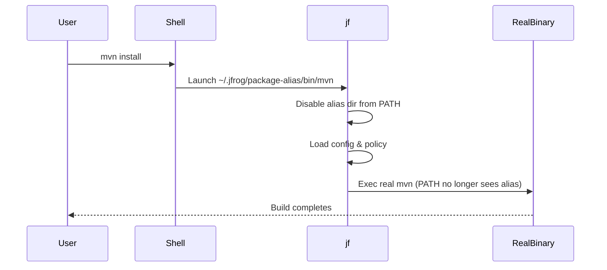

# **Technical Design: Per-Process JFrog CLI Package Aliasing**

**Version:** 1.1  
**Owner:** JFrog CLI Team  
**Last Updated:** 2025-11-12  

---

## **1. Overview**

The goal of this design is to make JFrog CLI automatically intercept common package manager commands such as `mvn`, `npm`, `go`, `gradle`, etc. without requiring users to prepend commands with `jf` (e.g., `jf mvn install`).  
Users should be able to continue running:

```bash
mvn clean install
npm install
go build
```

…and JFrog CLI should transparently process these commands using the user’s Artifactory configuration.

We call this feature **Package Aliasing**.

---

## **2. Motivation**

Today, users must explicitly prefix package manager commands with `jf`:

```bash
jf mvn install
jf npm install
```

This adds friction for large enterprises or CI systems that have hundreds of pipelines or legacy scripts.  
Our goal is **zero-change enablement** — install once, and all existing build commands automatically benefit from JFrog CLI.

---

## **3. Requirements**

| Category | Requirement |
|-----------|--------------|
| **Functionality** | Intercept common package manager binaries (`mvn`, `npm`, `yarn`, `pnpm`, `go`, `gradle`, etc.) |
| | Execute through JFrog CLI integration flows |
| | Allow fallback to real binaries if required |
| **Safety** | Avoid infinite recursion (loops) |
| | No modification to system binaries (no sudo) |
| | Work for user scope (non-root) |
| **Portability** | Linux, macOS, Windows |
| **Control** | Allow per-process disable, per-tool policy |
| **Simplicity** | Single fixed directory for aliases, predictable behavior |
| **No invasive change** | No modification to every `exec` or binary path in existing code |

---

## **4. Problem Evolution**

This section explains each major problem we encountered and how the solution evolved.

---

### **4.1 How to intercept native package manager commands**

**Problem:**  
We need a way for `mvn`, `npm`, etc. to invoke `jf` automatically.

**Explored Solutions:**

| Approach | Description | Pros | Cons |
|-----------|--------------|------|------|
| 1. Modify system binaries (/usr/bin) | Replace `/usr/bin/mvn` with wrapper pointing to `jf` | Transparent | Needs sudo, risky, hard to undo |
| 2. PATH-first “symlink farm” | Create `mvn → jf`, `npm → jf`, etc. in a user-controlled directory that appears first in `$PATH` | Safe, user-space only, reversible | Must manage PATH carefully |
| 3. LD_PRELOAD interception | Use dynamic linker trick to intercept exec calls | Too complex, platform-specific | Unmaintainable |
| 4. Shell aliasing | Define `alias mvn='jf mvn'` etc. | Shell-only, not CI-safe | |

**Decision:**  
✅ Use **PATH-first symlink farm** approach (Approach #2).  
We create symbolic links to `jf` in `~/.jfrog/package-alias/bin` and prepend this directory to `$PATH`.

---

### **4.2 Where to store aliases**

**Problem:**  
Users shouldn’t decide arbitrary paths for aliases — that leads to chaos in PATH management.

**Explored Solutions:**

| Option | Description | Drawback |
|---------|--------------|-----------|
| Allow users to specify install directory | `jf package-alias install --dir=/custom/dir` | Too many inconsistent setups |
| Fixed directory under ~/.jfrog | `~/.jfrog/package-alias/bin` | Predictable, easy to clean up |

**Decision:**  
✅ Fixed directory: `~/.jfrog/package-alias/bin` for Linux/macOS, `%USERPROFILE%\.jfrog\package-alias\bin` for Windows.

---

### **4.3 Avoiding loops / recursion (final decision)**

**Problem:**  
When `jf` is invoked via an alias (e.g., `~/.jfrog/package-alias/bin/mvn → jf`) and later tries to execute `mvn` again, a naive `PATH` lookup may return the alias *again*, creating a loop.

**Final Decision:**  
Use a **per-process PATH filter**. As soon as `jf` detects it was invoked via an alias (by checking `argv[0]`), it removes the alias directory from **its own** `PATH`. From that moment on, every `exec` or `LookPath` performed by this process (and any child processes it spawns) will only see the **real** tools, not the aliases. No global changes, no filesystem renames, no sudo.

**Why this solves recursion:**  
- The alias directory is *invisible* to this process after the filter.
- Any subsequent `exec.LookPath("mvn")` resolves to the real `mvn`.
- Children inherit the filtered `PATH`, so they can’t bounce back into aliases either.

**Code (core):**
```go
func disableAliasesForThisProcess() {
    aliasDir := filepath.Join(userHome(), ".jfrog", "package-alias", "bin")
    old := os.Getenv("PATH")
    filtered := filterOutDirFromPATH(old, aliasDir)
    _ = os.Setenv("PATH", filtered) // process-local, inherited by children
}
```

**Alternatives considered (rejected):**
- Absolute paths recorded at install time → safe but adds state to maintain.
- Env-guard like `JF_BYPASS=1` → requires propagation to all subprocesses.
- Renaming/temporarily hiding the alias directory → racy across shells/processes.

---

### **4.4 Why we do NOT use guard variables (e.g., `JF_BYPASS`)**

Using a guard env var would require **plumbing that variable through every exec site** and relying on every sub-tool to pass it along. This is brittle and easy to miss in a large legacy codebase. With the **per-process PATH filter**, no extra env propagation is needed; the operating system already inherits the filtered `PATH` for all children, which reliably prevents recursion.

> In short: **No guard variables are used.** The single mechanism is **per-process PATH filtering** applied at `jf` entry when invoked via an alias.

---

## **5. Final Architecture**

### **5.1 Components**

```
~/.jfrog/package-alias/
├── bin/                     # symlinks or copies to jf
│   ├── mvn -> /usr/local/bin/jf
│   ├── npm -> /usr/local/bin/jf
│   └── go  -> /usr/local/bin/jf
├── manifest.json            # real binary paths (optional)
├── config.yaml              # package modes, enabled flag
└── state.json               # internal enable/disable
```

### **5.2 High-level flow**

```mermaid
flowchart TD
    A[User runs mvn install] --> B[$PATH resolves ~/.jfrog/package-alias/bin/mvn]
    B --> C[jf binary invoked (argv[0] = "mvn")]
    C --> D[Disable alias dir from PATH for this process]
    D --> E[Lookup policy for mvn]
    E -->|mode = jf| F[Run jf mvn integration flow]
    E -->|mode = env| G[Inject env vars + exec real mvn]
    E -->|mode = pass| H[Exec real mvn directly]
    F --> I[Child processes inherit filtered PATH]
    G --> I
    H --> I[All children see real mvn; no loop]
```

---

## **6. Detailed Flow and Problem Solving**

### **6.1 Installation**

```bash
jf package-alias install
```

**Steps**
1. Create `~/.jfrog/package-alias/bin` if not exists.
2. Find `jf` binary path.
3. Create symlinks (`ln -sf`) or copies (on Windows) for each supported package manager.
4. Write `manifest.json` with discovered real binary paths.
5. Show message to add the directory to PATH:
   ```bash
   export PATH="$HOME/.jfrog/package-alias/bin:$PATH"
   ```
6. Ask user to `hash -r` (clear shell cache).

---

### **6.2 Execution (Intercept Flow)**

When a symlinked tool is run, e.g. `mvn`:

1. The OS resolves `mvn` to `~/.jfrog/package-alias/bin/mvn`.
2. The binary launched is actually `jf`.
3. Inside `jf`:
   ```go
   tool := filepath.Base(os.Args[0]) // mvn, npm, etc.
   if isAlias(tool) {
       disableAliasesForThisProcess() // remove alias dir from PATH
       mode := loadPolicy(tool)
       runByMode(tool, mode, os.Args[1:])
   }
   ```
4. `disableAliasesForThisProcess` updates the process’s environment:
   ```go
   func disableAliasesForThisProcess() {
       aliasDir := filepath.Join(userHome(), ".jfrog", "package-alias", "bin")
       old := os.Getenv("PATH")
       new := filterOutDirFromPATH(old, aliasDir)
       os.Setenv("PATH", new)
   }
   ```
5. From this point onward, any `exec.LookPath("mvn")` resolves to the *real* binary.

---

### **6.3 Fallback Handling**

If the integration flow fails (e.g., Artifactory config missing):

1. Try to exec the real binary using `syscall.Exec(realPath, args, env)`.
2. Because the alias dir was removed from PATH, `exec.LookPath(tool)` already points to the real one.
3. The process is replaced with the real binary — no recursion.

---

### **6.4 Disable/Enable**

```bash
jf package-alias disable
jf package-alias enable
```

Sets a flag in `~/.jfrog/package-alias/state.json`:
```json
{ "enabled": false }
```

During argv[0] dispatch, if disabled, `jf` immediately executes the real tool via filtered PATH.

---

### **6.5 Windows Behavior**

- Instead of symlinks, create **copies** of `jf.exe` named `mvn.exe`, `npm.exe`, etc.  
- PATH modification is identical (`%USERPROFILE%\.jfrog\package-alias\bin`).
- When invoked, `jf.exe` runs the same per-process `PATH` filtering logic.
- To run the real binary, use `where mvn` after filtering PATH.

---

## **7. Safety and Rollback**

| Action | Result |
|---------|--------|
| `jf package-alias uninstall` | Removes all symlinks and manifest |
| Remove PATH entry manually | Aliases no longer used |
| Delete `~/.jfrog/package-alias/bin` | Full disable, no residual effect |
| Run `hash -r` or new shell | Flushes cached command paths |

---

## **8. Key Advantages of Final Design**

| Problem | Solved By |
|----------|------------|
| Need to intercept `mvn`, `npm`, etc. | PATH-first symlinks |
| No sudo access | User directory only |
| Avoid infinite loops | Remove alias dir from PATH per process |
| No guard propagation | PATH change inherited automatically |
| Fallback to real binaries | `exec.LookPath` + filtered PATH |
| Disable/enable easily | config flag or uninstall |
| Cross-platform support | symlinks (POSIX) / copies (Windows) |

---

## **9. Example Run**

```bash
$ jf package-alias install
Created 8 aliases in ~/.jfrog/package-alias/bin
Add this to your shell rc:
  export PATH="$HOME/.jfrog/package-alias/bin:$PATH"

$ mvn clean install
# -> actually runs jf, which removes alias dir from PATH, executes jf mvn logic,
# -> calls real mvn when needed without recursion.
```

---


## **10. Future Enhancements**

The long-term vision for **JFrog Package Alias** goes beyond just command interception — it aims to make **automatic Artifactory enablement** possible for any environment, regardless of prior repository configuration.

### **10.1 Auto-Configuration of Package Managers**

When JFrog CLI is installed and package aliasing is enabled, the CLI can automatically:
- Detect the **project type** (Maven, NPM, Go, Gradle, Python, etc.).
- Read the existing configuration (e.g., `.npmrc`, `settings.xml`, `go env GOPROXY`, etc.).
- Update or patch configuration files to route all dependency downloads and publishes to **JFrog Artifactory**.

**Example flow:**
```bash
$ jf package-alias configure
🔧 Detected package managers: npm, maven, go
✔ npmrc updated to use Artifactory registry
✔ Maven settings.xml updated with Artifactory server
✔ GOPROXY updated to Artifactory virtual repository
```

---

### **10.2 Guided Migration from Other Repository Managers**

Many organizations use other repository managers such as:
- Sonatype Nexus
- GitHub Packages
- AWS CodeArtifact

The future roadmap includes:
- **Repository discovery:** Auto-detect the current registry configuration (e.g., Nexus URLs in `.npmrc`).
- **Migration wizard:** Offer an interactive CLI flow to switch all configuration files to JFrog Artifactory equivalents.
- **Backup and rollback:** Keep snapshots of old configuration before migration.
- **Per-package dry run:** Allow testing the new configuration before committing changes.

**Example:**
```bash
$ jf package-alias migrate --from nexus --to artifactory
Detected:
  - npm registry: https://nexus.company.com/repository/npm/
  - maven repo:   https://nexus.company.com/repository/maven/
Proposed Artifactory routes:
  - npm -> https://artifactory.company.com/artifactory/api/npm/npm-virtual/
  - maven -> https://artifactory.company.com/artifactory/maven-virtual/
Proceed? [Y/n]: y
✔ Migration complete
✔ Old configs backed up to ~/.jfrog/package-alias/backup/
```

---

### **10.3 Centralized Configuration via JFrog CLI**

Introduce a command like:
```bash
jf package-alias sync-config
```
This would:
- Pull centralized configuration from the user’s JFrog CLI `jfrog config` profiles.
- Automatically apply the right registry endpoints, credentials, and repositories to all supported package managers.
- Keep these configurations in sync when JFrog CLI profiles are updated.

---

### **10.4 Smart Policy Mode (Adaptive Interception)**

- Detect whether the current directory/project has been **previously configured** for Artifactory.
- If not, automatically prompt to configure or fallback to transparent passthrough mode.
- Eventually, support a **“hybrid mode”** where alias interception automatically toggles between “jf” and “native” mode based on the project’s detected configuration.

---

### **10.5 Enterprise Integration**

- Centralized management of package-alias policies through JFrog Mission Control or Federation.
- Audit and telemetry: “Which pipelines are using aliases, which tools were intercepted, success/failure metrics.”
- Self-healing configurations that automatically repair broken `.npmrc` or `settings.xml` references.

---

### **Vision Summary**

| Goal | Outcome |
|------|----------|
| **Zero manual setup** | Auto-configure package managers to use Artifactory |
| **Seamless migration** | Migrate from Nexus or other managers in one command |
| **Self-healing configs** | Detect and fix broken repository references |
| **Centralized governance** | Sync alias and registry settings via JFrog CLI profiles |
| **Predictive intelligence** | Detect project type and apply correct settings instantly |


## **11. Code Snippets**

**Filter alias dir (core function):**
```go
func filterOutDirFromPATH(pathVal, rm string) string {
    rm = filepath.Clean(rm)
    parts := filepath.SplitList(pathVal)
    keep := make([]string, 0, len(parts))
    for _, d in := range parts { // pseudo for brevity
        if d == "" { continue }
        if filepath.Clean(d) == rm { continue }
        keep = append(keep, d)
    }
    return strings.Join(keep, string(os.PathListSeparator))
}
```

**Disable alias dir (apply once at entry):**
```go
func disableAliasesForThisProcess() {
    aliasDir := filepath.Join(userHome(), ".jfrog", "package-alias", "bin")
    old := os.Getenv("PATH")
    filtered := filterOutDirFromPATH(old, aliasDir)
    _ = os.Setenv("PATH", filtered)
}
```

**Find real binary (after PATH filtered):**
```go
func findRealBinary(tool string) (string, error) {
    p, err := exec.LookPath(tool)
    if err != nil {
        return "", fmt.Errorf("real %s not found", tool)
    }
    return p, nil
}
```

**Exec real tool (POSIX):**
```go
func execReal(tool string, args []string) {
    real, _ := findRealBinary(tool)
    syscall.Exec(real, append([]string{tool}, args...), os.Environ())
}
```

---

## **12. Diagrams**

### **12.1 Process Flow (simplified)**



---

## **13. References**

- [BusyBox Multicall Design](https://busybox.net/downloads/BusyBox.html)
- [Go syscall.Exec Documentation](https://pkg.go.dev/syscall#Exec)
- [JFrog CLI Documentation](https://docs.jfrog.io/jfrog-cli)
- [Microsoft CreateProcess API](https://learn.microsoft.com/en-us/windows/win32/api/processthreadsapi/nf-processthreadsapi-createprocessa)

---

## **14. Summary**

| Attribute | Final Decision |
|------------|----------------|
| **Command Name** | `jf package-alias` |
| **Alias Directory** | `~/.jfrog/package-alias/bin` |
| **Recursion Avoidance** | Per-process PATH filtering |
| **Guard Variables** | None used |
| **Fallback** | Filtered PATH lookup + exec |
| **Configuration** | Hybrid (default map + optional YAML override) |
| **Disable/Enable** | Config flag or uninstall |
| **Platform Support** | Linux, macOS, Windows |

---

**End of Document**
